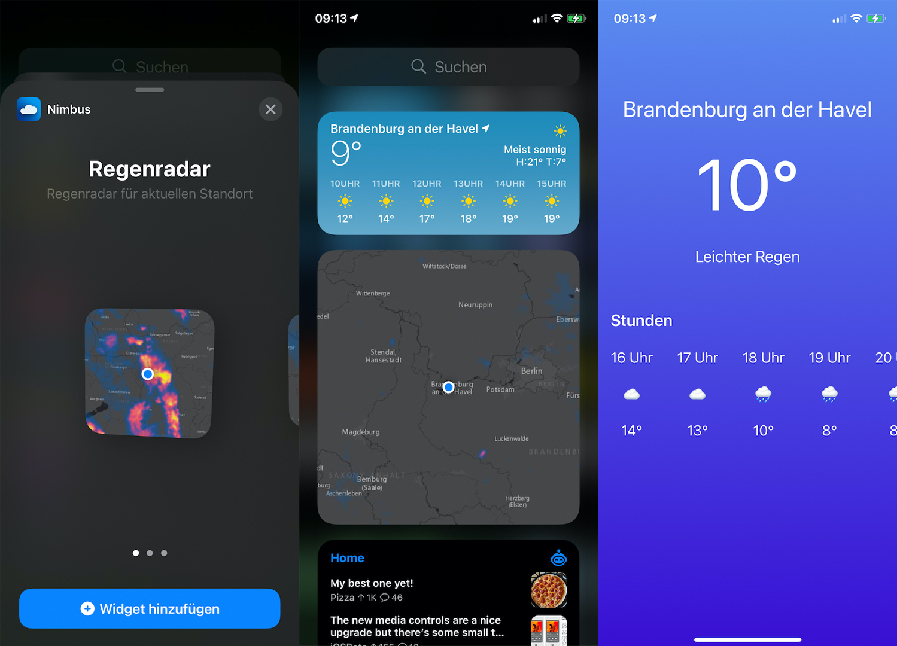

# iOS 14 Radar Widget
This iOS App adds a weather radar app in a rather hacky way to your home screen. This is my first iOS app, should not be used in production and is far from perfect or done.

Because widgets can only display static text or images, and I struggled using MKSnapshotter of a MKMapView with an overlay, the radar image for the widget gets served by an api. When an api call happens, a screenshot of a local website with a map and a rain overlay is created and served as the api response. I know, I know, don't judge me... 🤫

What's done:
- rain radar for your current location
- a dummy app screen

What has to be done:
- add OpenWeatherMap support
- finish UI
- add input for static weather location

What could be done:
- implement radar map as snapshot (MKSnapshotter) of the MKMapView with the rain overlay. I wasn't successful with that so far, hence the screenshot api.

