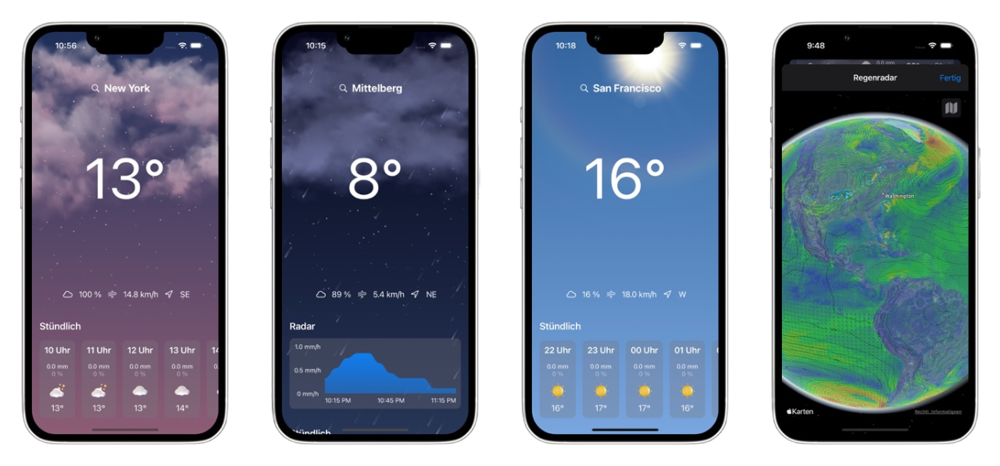

# Oscar Weather App for iOS
This iOS weather app adds a weather radar widget in a rather hacky way (!screenshot API!) to your home screen. This is my first iOS app, should not be used in production and is far from perfect or done.

What's done:
- rain radar widget for your current location
- an unfinished app UI
- OpenWeatherMap integration for fixed lat/ lon

What has to be done:
- finish UI
- add manual input for weather location
- add support for multiple weather locations
- add more widgets

What could be done:
- implement radar map as snapshot (MKSnapshotter) of the MKMapView with the rain overlay. I wasn't successful with that so far, hence the screenshot api.

