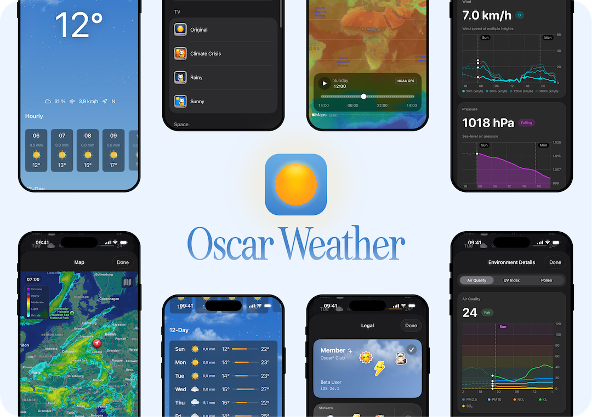

  

<h1 align="center">Oscar Weather</h1>

  A SwiftUI weather app with global forecasts and enhanced regional coverage for Europe.

  
  
  
  

---

## Overview

Oscar provides current conditions, hourly and daily forecasts, rain radar, air quality, and weather alerts. Forecasts work globally via Open-Meteo's `best_match` feature, which automatically selects from 15+ national weather services (DWD, ECMWF, NOAA, Météo-France, and others) based on location. Several features are region-specific -- see details below.

> **Note:** Oscar° is in active development and not yet intended for production use.

---

## Features

### Forecasts — Global
- Current conditions: temperature, wind, cloud cover, humidity, pressure, UV index
- 36-hour hourly forecast and 12-day daily forecast
- Probabilistic ensemble forecasts
- Sunrise & sunset times

### Rain Radar — Germany / Central Europe
- Interactive radar map with self-hosted rain tiles and timeline playback
- 2-hour rain intensity chart sourced from BrightSky (DWD data, Germany-focused)
- RainViewer global radar overlay

### Air Quality & Environment — Global
- Real-time AQI with hourly trend chart
- Soil temperature and moisture at multiple depths (0–81 cm)
- Evapotranspiration (ET0), atmospheric pressure, and humidity
- Pollen levels by type -- Europe only (alder, birch, grass, mugwort, ragweed)

### Weather Alerts
- Germany: live warnings via BrightSky (DWD data)
- Canada: live warnings via Environment Canada
- Alert details include valid time window and severity description
- Push notifications for rain events -- Germany / Central Europe only

### Map Layers — Global / Central Europe
Forecast map tiles are generated in-house for the next 3 days across three variables:

| Layer | Source | Coverage |
|---|---|---|
| Temperature | DWD ICON D2 | Central Europe |
| Wind | DWD ICON D2 | Central Europe |
| Precipitation | DWD ICON D2 | Central Europe |
| Temperature | NOAA GFS | Global |
| Wind | NOAA GFS | Global |
| Precipitation | NOAA GFS | Global |

### Widgets
- **Home Screen:** current conditions widget, global radar widget
- **Lock Screen:** temperature and precipitation widgets

### Animated Backgrounds
- Metal shader-rendered scenes that reflect current conditions
- States: clear, partly cloudy, overcast, rain, storm, snow, night
- Sun and meteor positions follow time of day and location

---

## Data Sources

| Source | Used For | Coverage |
|---|---|---|
| [Open-Meteo](https://open-meteo.com/) | Forecasts, air quality, ensemble models | Global |
| [BrightSky](https://brightsky.dev/) | Rain intensity chart, weather alerts | Germany |
| [DWD](https://www.dwd.de/) | Radar tiles | Germany / Central Europe |
| [RainViewer](https://www.rainviewer.com/) | Radar map overlay | Global |
| [Environment Canada](https://weather.gc.ca/) | Weather alerts | Canada |

---

## Getting Started

1. Clone the repository
2. Open `Oscar°.xcodeproj` in Xcode 16 or later
3. Select your development team in the project signing settings
4. Build and run on a device or simulator running iOS 26+

---

## Join the Beta

Public beta is available on TestFlight:

**[Oscar° Beta → testflight.apple.com/join/xf5iJcHh](https://testflight.apple.com/join/xf5iJcHh)**

---

## Contributing

Contributions are welcome — bug fixes, new features, or improvements to existing ones. Just open a pull request with a clear description of what you changed and why. For larger changes, opening an issue first to discuss the direction is appreciated.

---

## Acknowledgements

- Forecast & air quality data — [Open-Meteo](https://open-meteo.com/) (CC BY 4.0)
- Rain radar & German weather alerts — [BrightSky](https://brightsky.dev/) / [DWD](https://www.dwd.de/)
- Canadian weather alerts — [Environment Canada](https://weather.gc.ca/)
- Radar overlay — [RainViewer](https://www.rainviewer.com/)
- 3D weather icons — [Hosein Bagheri](https://ui8.net/hosein_bagheri/products/3d-weather-icons40)
- Animated background techniques — [Hacking with Swift](https://www.hackingwithswift.com)
- Error tracking — [Sentry](https://sentry.io/)
