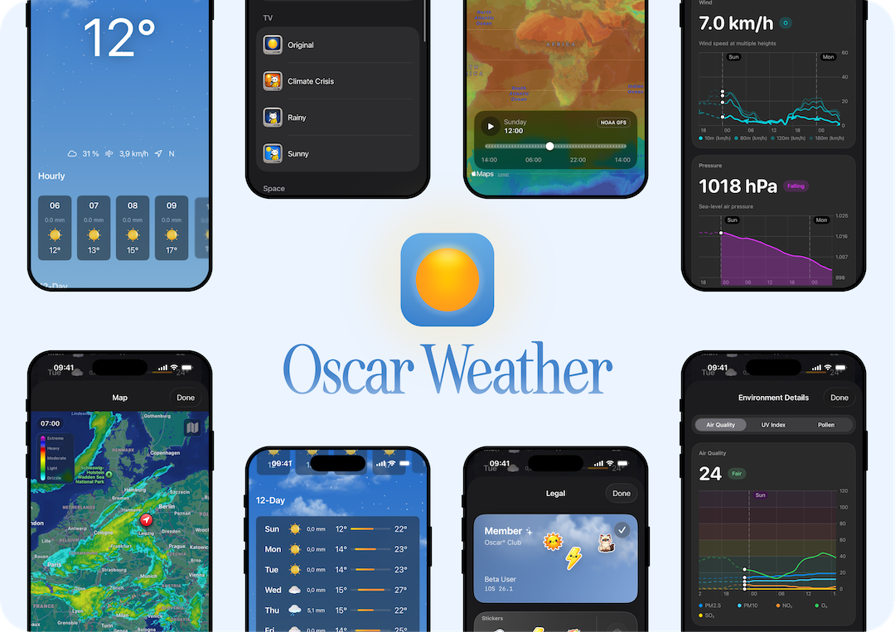

  

<h1 align="center">Oscar Weather</h1>

  A SwiftUI weather app with global forecasts and enhanced regional coverage for radar, satellite, and alerts.

  
  
  
  

---

## Overview

Oscar provides current conditions, an hourly and daily forecast, rain radar, satellite imagery, air quality, and severe weather alerts, on iPhone and Apple Watch. Forecasts work globally through Open-Meteo's `best_match` feature, which automatically picks a national weather service for the location, and 17 individual models can be selected by hand. Radar, satellite, and alerts have their own regional coverage, listed below.

> **Note:** Oscar° is in active development and not yet intended for production use.

---

## Features

### Forecasts, Ensembles & Climate: Global
- Current conditions: temperature, wind, cloud cover, humidity, pressure, UV index
- 48-hour hourly forecast and 12-day daily forecast
- Probabilistic ensemble forecasts for temperature, precipitation, and wind
- An hourly detail deck with a live value for every metric (wind, humidity, pressure, clouds, soil temperature and moisture, evapotranspiration), each expandable into its own chart, plus a toggleable chapter timeline
- A warming-stripes climate timeline built from decades of daily-high history
- 17 selectable forecast models (ECMWF, DWD ICON, NOAA GFS, Météo-France, UK Met Office, and more) in addition to the automatic best-match pick
- Sunrise and sunset times

### Radar & Satellite: Regional
- Live rain radar with short-term nowcast and a playable timeline: DWD (Germany / Central Europe), EUMETNET OPERA (Europe), NOAA MRMS (USA), CWA QPESUMS (Taiwan), REDEMET (Brazil), and AEMET (Canary Islands)
- Storm cell tracking with footprints and projected paths, where radar coverage exists
- Live satellite cloud imagery from EUMETSAT's Meteosat, covering Europe, Africa, and the Atlantic, updated every 15 minutes
- Adjustable motion arrows, smoothing, and opacity, plus three basemap styles (Fiord, Dark, Light)

### Map Layers: Central Europe and Global
Forecast tiles for precipitation, temperature, wind, and pressure (with isobars), generated in-house:

| Coverage | Source |
|---|---|
| Central Europe | DWD ICON-D2 |
| Global | ECMWF IFS |

### Air Quality & Environment
- Global: real-time AQI (PM2.5, PM10, NO2, O3, SO2) with an hourly trend chart
- Global: UV index, soil temperature and moisture at multiple depths, and evapotranspiration (ET0)
- Europe only: pollen levels by type (alder, birch, grass, mugwort, ragweed)

### Weather Alerts & Notifications
- In-app alerts and warning polygons: Germany (DWD, native), the rest of Europe plus Israel (Meteoalarm), the United States (NWS), Canada (Environment Canada), and Taiwan (CWA)
- Beta push notifications: rain alerts for Europe, the United States, Taiwan, and Brazil, and severe weather alerts for Europe, the United States, and Taiwan
- A Live Activity shows an approaching rain status on the Lock Screen and in the Dynamic Island

### Widgets
- Home Screen: rain radar for the current location (configurable style, smoothing, motion arrows, storm cells), a global-reach rain radar, a current-conditions widget, and a multi-day forecast widget with a selectable city (small, medium, large)
- Lock Screen and Apple Watch complications: temperature, precipitation, a rain-history graph, UV index, and wind
- Live Activity: live rain status on the Lock Screen and in the Dynamic Island

### Apple Watch App
A four-page vertical stack: an animated current-conditions scene, a rain nowcast page (where radar coverage exists), the hourly forecast, and the daily forecast.

### Animated Backgrounds
- Metal shader-rendered scenes that reflect current conditions
- States: clear, partly cloudy, overcast, rain, storm, snow, night
- Sun and star positions follow time of day and location

---

## Data Sources

| Source | Used For | Coverage |
|---|---|---|
| [Open-Meteo](https://open-meteo.com/) | Forecasts, ensemble models, air quality, climate archive | Global (pollen: Europe) |
| [DWD](https://www.dwd.de/) | Radar composite, weather warnings | Germany / Central Europe |
| [EUMETNET](https://www.eumetnet.eu/) (OPERA) | Radar composite | Europe |
| [NOAA](https://www.noaa.gov/) | Radar composite (MRMS), weather alerts (NWS) | USA |
| [CWA](https://www.cwa.gov.tw/) | Radar composite (QPESUMS), weather alerts | Taiwan |
| [REDEMET](https://redemet.decea.mil.br/) (DECEA) | Radar composite | Brazil |
| [AEMET](https://www.aemet.es/) | Radar composite | Canary Islands |
| [ECMWF](https://www.ecmwf.int/) | Global forecast model, map layers | Global |
| [EUMETSAT](https://www.eumetsat.int/) | Satellite cloud imagery (Meteosat) | Europe / Africa / Atlantic |
| [Environment Canada](https://weather.gc.ca/) | Weather alerts | Canada |
| [OpenStreetMap](https://www.openstreetmap.org/) / [OpenFreeMap](https://openfreemap.org/) | Map data and tiles | Global |

---

## Getting Started

1. Clone the repository
2. Open `Oscar°.xcodeproj` in Xcode 26 or later
3. Select your development team in the project signing settings
4. Build and run on a device or simulator running iOS 26 or watchOS 26

---

## Join the Beta

Public beta is available on TestFlight:

**[Oscar° Beta on TestFlight: testflight.apple.com/join/xf5iJcHh](https://testflight.apple.com/join/xf5iJcHh)**

---

## Contributing

Contributions are welcome, whether bug fixes, new features, or improvements to existing ones. Just open a pull request with a clear description of what you changed and why. For larger changes, opening an issue first to discuss the direction is appreciated.

---

## Acknowledgements

- Forecast, air quality, and climate data: [Open-Meteo](https://open-meteo.com/) (CC BY 4.0)
- Radar and weather warnings: [DWD](https://www.dwd.de/), [EUMETNET](https://www.eumetnet.eu/) (OPERA), [NOAA](https://www.noaa.gov/), [CWA](https://www.cwa.gov.tw/), [REDEMET](https://redemet.decea.mil.br/) / DECEA, [AEMET](https://www.aemet.es/)
- Weather alerts: [Environment and Climate Change Canada](https://weather.gc.ca/)
- Satellite cloud imagery: [EUMETSAT](https://www.eumetsat.int/)
- Forecast models: [ECMWF](https://www.ecmwf.int/)
- Map data and tiles: [OpenStreetMap](https://www.openstreetmap.org/) contributors, [OpenFreeMap](https://openfreemap.org/), rendered with [MapLibre Native](https://maplibre.org/)
- 3D weather icons: [Hosein Bagheri](https://ui8.net/hosein_bagheri/products/3d-weather-icons40)
- Error tracking: [Sentry](https://sentry.io/)
- Networking: Apple's [swift-openapi-generator](https://github.com/apple/swift-openapi-generator), swift-openapi-runtime, and swift-openapi-urlsession
